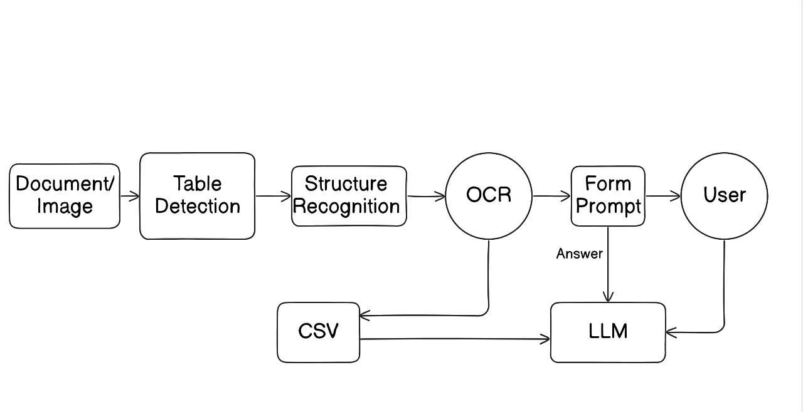
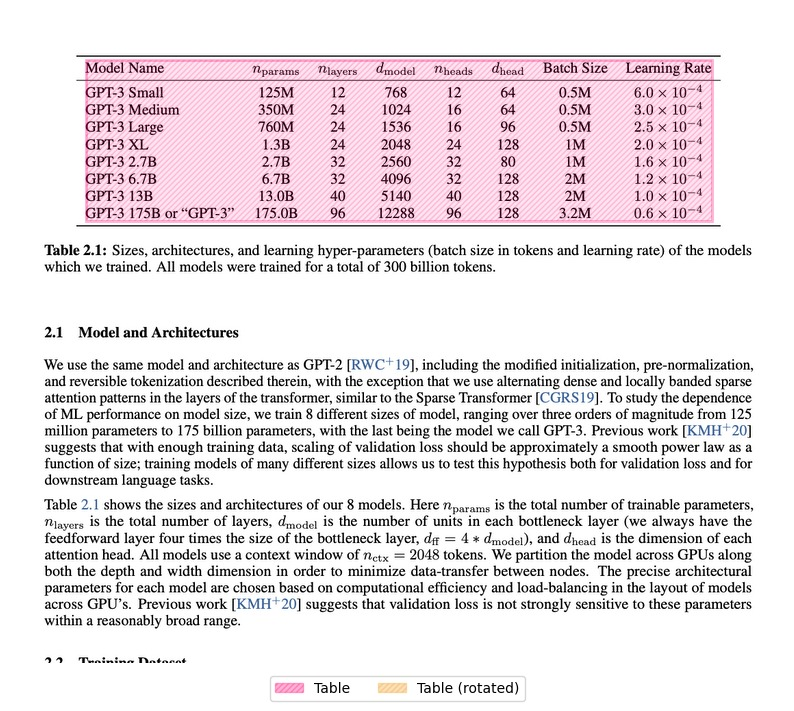

# TableEx 📑

## Table of Contents

- [Project Description](#project-description)
- [System Workflow](#system-workflow)
- [Installation](#installation)
- [Usage](#usage)
- [File Descriptions](#file-descriptions)


## Project Description

This project utilizes deep learning and natural language processing to extract tabular data from images and PDFs, combines related tables, and allows users to query the extracted data using natural language.  It leverages the Table Transformer model for table detection and structure recognition, PaddleOCR for optical character recognition, and Google Gemini for combining tables and answering user queries.  The results are presented in an interactive HTML format. ✨

## System Workflow



The system operates through the following steps:

1. **Image/PDF Upload:** Users upload an image or PDF containing tabular data. ⬆️

2. **Table Detection & Cropping:** The Table Transformer model detects and crops tables from the uploaded document. ✂️




    
3. **OCR & CSV Extraction:** PaddleOCR extracts text from the cropped tables and saves the data into individual CSV files. 📄
    
6. **Table Combination (PDFs):** For PDF inputs, Google Gemini analyzes the extracted CSV files and combines related tables into single CSV files. 🔗
    
7. **CSV to HTML Conversion:**  CSV data is converted to HTML tables for interactive display. 🌐
    
8. **Natural Language Querying:** Users can query the combined table data using natural language, and Google Gemini provides answers based on the extracted information.  ❓
    

## Installation

1. Clone the repository:
   ```bash
   git clone https://github.com/your-username/DL_Hackathon_G35.git
   cd DL_Hackathon_G35
   ```
2. Install the required packages:
   ```bash
   cd mdodel-backend && pip install -r requirements.txt
   ```
3. Set up Cloudinary credentials:
   - Create a Cloudinary account and obtain your `cloud_name`, `api_key`, and `api_secret`.
   - Update the `cloudinary_util.py` file with your credentials.
4. Set up Google Gemini API Key:
   - Obtain a Google Gemini API key.
   - Replace the placeholder API key in `app.py`, `combine.py`, and `csv2html.py` with your actual key.
5. Set up Hugging Face Token:
   - Obtain a Hugging Face token and replace the placeholder token in `mode_init.py` with your token.

6. Setup frontend
   - Install npm modules
     ```bash
     cd vlm-app && npm install
     ```

## Usage

1. Run the Flask application:
   ```bash
   python app.py <port>
   ```
2. Send POST requests to the `/processImage` and `/processPdf` endpoints to process images and PDFs, respectively.
3. Send POST requests to the `/ask` endpoint to query the extracted table data.
4. Run frontend server
   ```
   cd vlm-app && npm run dev
   ```


## File Descriptions

- `app.py`: Main Flask application file.
- `cloudinary_util.py`: Utility functions for interacting with Cloudinary.
- `combine.py`: Contains functions for combining CSV tables from PDFs using Google Gemini.
- `combine_csv.py`:  Contains logic for combining CSV tables based on header analysis.
- `csv2html.py`: Utility functions for converting CSV data to HTML tables using Google Gemini.
- `extract_table.py`: Contains functions for table detection, cropping, OCR, and structure recognition.
- `functional_agents.py`:  (Incomplete) Placeholder for code generation functionality.
- `mode_init.py`: Initializes the Llama 3 pipeline.
- `table_extraction.py`: Contains functions for extracting tables from PDF documents. 
